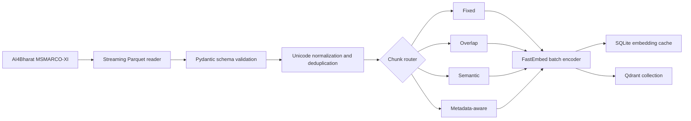
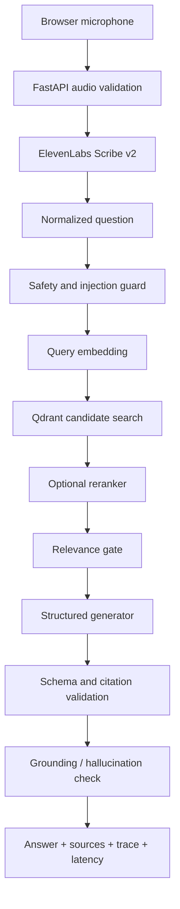

# Architecture

## Design goals

NEXUS optimizes for grounded output, measurable behavior, multilingual retrieval, transparent provenance, and graceful failure. External services are isolated behind interfaces, and no failure is allowed to silently become an invented answer.

## Offline data path

Ingestion writes documents, chunks, and held-out queries as separate JSONL artifacts. Stable document IDs depend on dataset language, query ID, passage position, and normalized content. Stable chunk IDs also include strategy and chunk position.

## Online request path

Text questions enter at the normalized-question stage. `/retrieve` stops after reranking. `/query` and `/voice-query` traverse the entire harness.

## Modules

| Package | Responsibility |
|---|---|
| `rag/ingestion` | Real schema, streaming, validation, cleaning, IDs |
| `rag/chunking` | Four strategies and statistics |
| `rag/embeddings` | Production FastEmbed provider and persistent cache |
| `rag/vector_store` | Qdrant interface, filters, CRUD, health |
| `rag/retrieval` | Query normalization and measured retrieval |
| `rag/reranking` | No-op, lexical fusion, optional cross-encoder |
| `rag/generation` | Extractive fail-safe, direct llama.cpp, llama server |
| `rag/guardrails` | Safety, relevance, citation and grounding gates |
| `rag/orchestration` | Request IDs, traces, retries/failure boundaries |
| `rag/evaluation` | Recall, MRR, failure rate, latency |
| `backend/app` | Typed HTTP API, CORS, limits, logging, STT |
| `frontend/src` | Recording, state, trace, answer, sources, performance |

## Failure behavior

| Failure | API outcome |
|---|---|
| Empty/oversized query | 422 or structured invalid-query refusal |
| Unsafe/injection request | Safe refusal; retrieval is skipped |
| Empty/invalid/oversized audio | 413/415/422 |
| Missing/rejected STT key | 503 with configuration-safe message |
| STT timeout/rate limit | 503/429 with retry guidance |
| Qdrant unavailable | 503; no generator call |
| No/weak context | Grounded refusal |
| Generator exception/malformed JSON | 502; unsupported text is hidden |
| Unknown citations/unsupported claims | Hallucination refusal |

## Latency boundaries

Each trace records validation, safety, embedding, vector search, reranking, generation, grounding, and total time. Voice responses additionally contain STT and voice-to-answer wall time. Connection reuse, embedding cache, batch ingestion, local vector search, and small top-K minimize avoidable work.
